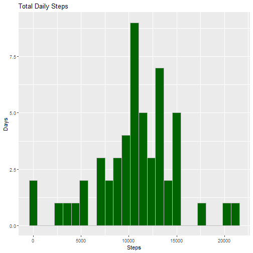
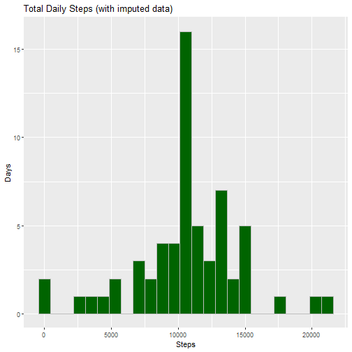
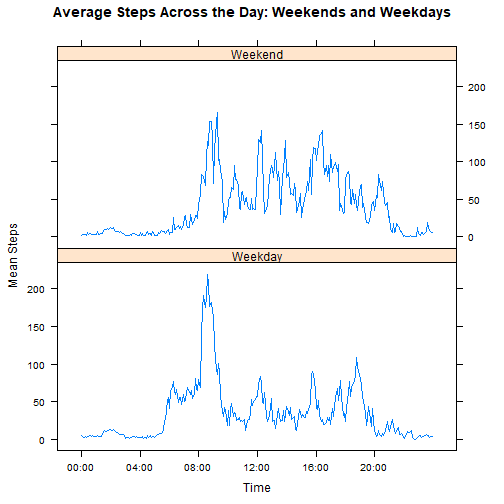

## Loading and preprocessing the data

```r
library(lubridate, quietly = TRUE)
library(stringr, quietly = TRUE)

#get data
temp <- tempfile()
download.file("https://d396qusza40orc.cloudfront.net/repdata%2Fdata%2Factivity.zip",temp)
activity<- read.csv(unz(temp, "activity.csv"))
unlink(temp)

#format dates and times
activity$date<- ymd(activity$date)

activity$interval<- str_pad(activity$interval, 4, pad = "0")
activity$interval<- hm(paste(substr(activity$interval,1,2),":",substr(activity$interval,3,4)))

#create version without missing days
activity2<- subset(activity,is.na(activity$steps)==FALSE)
```
  
This is an analysis of the number of steps taken throughout the day, based single person's activity. The data cover 53 days between October 2nd and November 29th, 2012.There was no data recorded on October 8th, or November 1st, 4th, 9th, 10th, or 14th.  


## What is mean total number of steps taken per day?
 
First, we will examine total steps in a day. The distribution of steps per day looks like this:


```r
library(ggplot2, quietly = TRUE)

#summarize steps per day
daysteps<- with(activity2,tapply(steps,date,sum))

#plot
qplot(daysteps, main="Total Daily Steps", ylab = "Days", xlab = "Steps",
      bins=25, fill=I("dark green"), col=I("gray"))
```



```r
#get average statistics
mn<- round(mean(daysteps),0)
md<- median(daysteps)
```
  
The number of daily steps has a mean of 10,766 and a median of 10,765.  


## What is the average daily activity pattern?
Next, the average number of steps over the course of a day:  
  

```r
library(plyr, quietly = TRUE)
```

```
## 
## Attaching package: 'plyr'
```

```
## The following object is masked from 'package:lubridate':
## 
##     here
```

```r
library(dplyr, quietly = TRUE)
```

```
## Warning: package 'dplyr' was built under R version 3.6.1
```

```
## 
## Attaching package: 'dplyr'
```

```
## The following objects are masked from 'package:plyr':
## 
##     arrange, count, desc, failwith, id, mutate, rename, summarise,
##     summarize
```

```
## The following objects are masked from 'package:lubridate':
## 
##     intersect, setdiff, union
```

```
## The following objects are masked from 'package:stats':
## 
##     filter, lag
```

```
## The following objects are masked from 'package:base':
## 
##     intersect, setdiff, setequal, union
```

```r
#summarize steps per interval - mean and standard deviation
timesteps<- activity2 %>% 
            group_by(as.character(interval)) %>% 
            summarize(mn_steps=mean(steps),std_step=sd(steps)) %>% 
            rename(interval_chr="as.character(interval)") %>%
            mutate(interval=case_when(
                  is.na(hms(interval_chr)) & is.na(ms(interval_chr)) ~ hms("00:00:00"),
                  is.na(hms(interval_chr)) & !is.na(ms(interval_chr)) ~ ms(interval_chr),
                  TRUE ~ hms(interval_chr)))%>%
            arrange(as_datetime(interval))
```

```
## Warning in .parse_hms(..., order = "HMS", quiet = quiet): Some strings
## failed to parse, or all strings are NAs
```

```
## Warning in .parse_hms(..., order = "MS", quiet = quiet): Some strings
## failed to parse, or all strings are NAs
```

```
## Warning in .parse_hms(..., order = "HMS", quiet = quiet): Some strings
## failed to parse, or all strings are NAs
```

```
## Warning in .parse_hms(..., order = "MS", quiet = quiet): Some strings
## failed to parse, or all strings are NAs

## Warning in .parse_hms(..., order = "MS", quiet = quiet): Some strings
## failed to parse, or all strings are NAs
```

```
## Warning in .parse_hms(..., order = "HMS", quiet = quiet): Some strings
## failed to parse, or all strings are NAs
```

```r
#plot
plot(as_datetime(timesteps$interval),timesteps$mn_steps, type='l',
     main="Average Steps Across the Day", ylab = "Steps", xlab = "Time",
     col="red", lwd=2.5)
```


```r
#get max stats
max<- max(timesteps$mn_steps)
timeMax<- as_datetime(timesteps$interval)[timesteps$mn_steps==max]
```
  
On average, steps peak at 08:35 with 206 steps.


## Imputing missing values

```r
#number of rows with missing values
NA_rows<- length(activity$steps[is.na(activity$steps)])

#create variables for merging
timesteps$mg<- as_datetime(timesteps$interval)
activity$mg<-  as_datetime(activity$interval)

#merge activity data with summary data
activity3<-merge(activity, timesteps, by="mg",all=TRUE)
activity3<- activity3%>%
      select(steps,date,interval.x,mn_steps,std_step)%>%
      arrange(date,as_datetime(interval.x))%>%

#simulate missing values using mean of each time interval with poisson distribution
mutate(new_steps=ifelse(!is.na(steps),steps,rpois(10000,lambda=mn_steps)))

#get average statistics, including imputed data
daysteps2<- with(activity3,tapply(new_steps,date,sum))
mn2<- round(mean(daysteps2),0)
md2<- median(daysteps2)
```
With the missing days, there are 2304 rows with missing values.  
  
We can impute the missing data by picking from a poisson distribution based on the 
average number of steps for each interval. If we do so, the distribution of steps per day looks like this:


```r
qplot(daysteps2, main="Total Daily Steps (with imputed data)", ylab = "Days", xlab = "Steps",
      bins=25, fill=I("dark green"), col=I("gray"))
```



We can see that this increases the number of days that are close to the center of the distribution, since the imputed days are based on mean tendencies. The new mean, 10,766, and median, 10,765, are fairly similar to the old mean and median. It is only the variation that has decreased.  


## Are there differences in activity patterns between weekdays and weekends?
It is possible that our imputation might be more accurate if we took into account the day of the week. Let's see if there is a difference in activity between weekend and weekday activity. This analysis uses the imputed data.  


```r
library(lattice, quietly = TRUE)

#add variable for weekend status
activity3<- mutate(activity3,weekday=as.factor(case_when(
            weekdays(date) %in% c("Saturday","Sunday") ~ "Weekend",
            TRUE ~ "Weekday")))

#summarize by weekend status and time
wksteps<-  activity3 %>% 
      group_by(as_datetime(interval.x),weekday) %>% 
      summarize(mean_steps=mean(new_steps)) %>% 
      rename(interval="as_datetime(interval.x)") 

#plot
tm<- as.POSIXct(wksteps$interval)
with(wksteps,xyplot(mean_steps~interval|weekday, layout=c(1,2), type="l",
                    main="Average Steps Across the Day: Weekends and Weekdays", xlab="Time", ylab="Mean Steps",
                    scales=list(x=list(at=  seq( tm[1], tm[576], by="4 hour") , 
                                       labels=format( seq( tm[1], tm[576], by="4 hour") , "%H:%M")) )
                                ))
```



It seems that weekday steps are more concentrated in the morning, while weekend steps are more evenly spread out through the day. Imputation would most likely be improved by creating means for weekends and weekdays separately.
